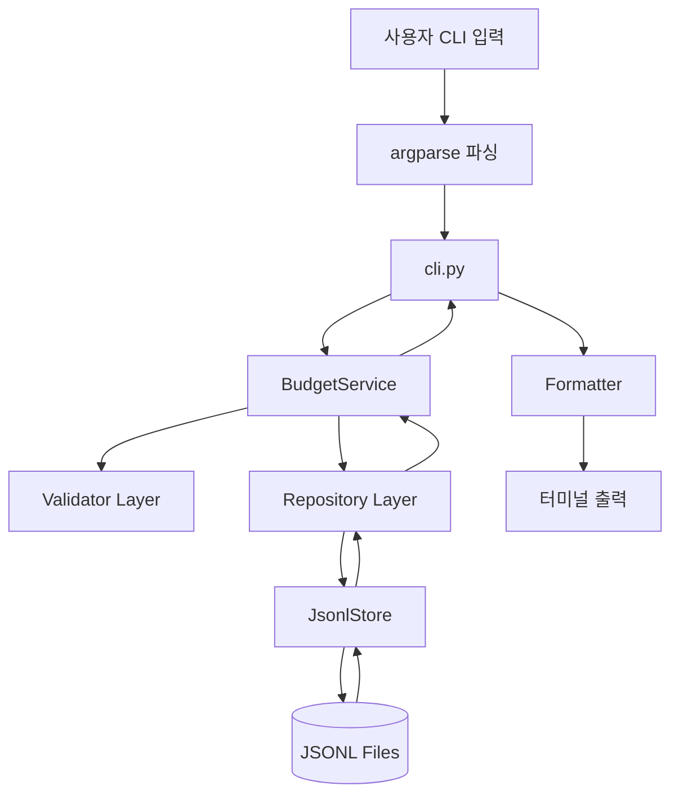
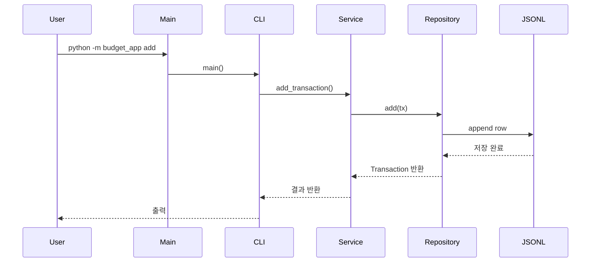
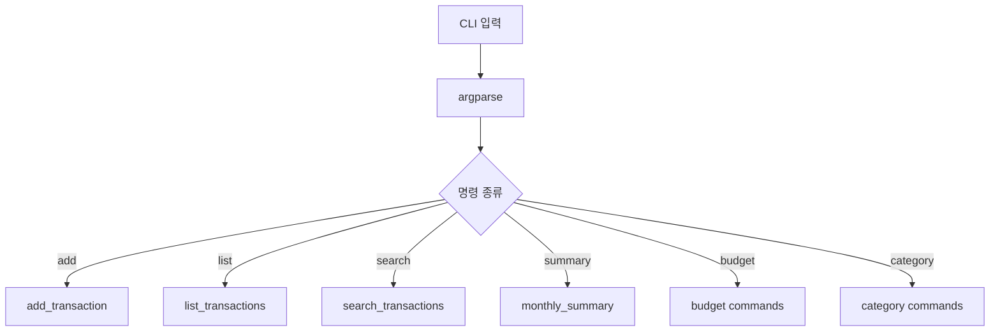
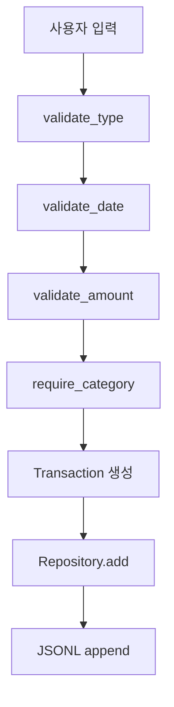
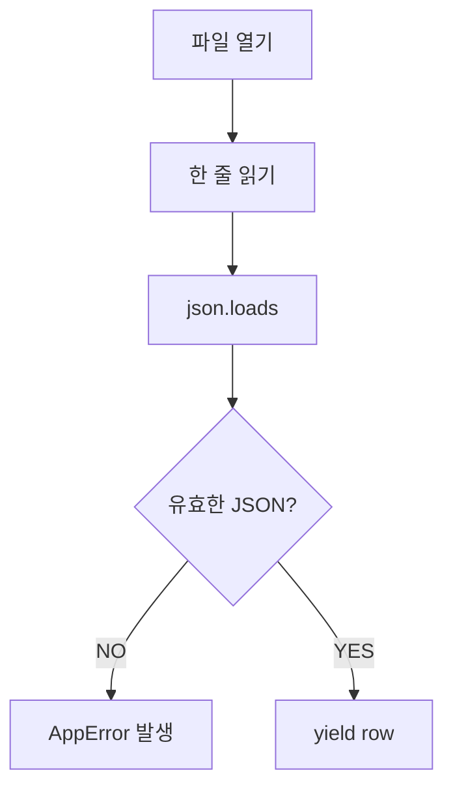
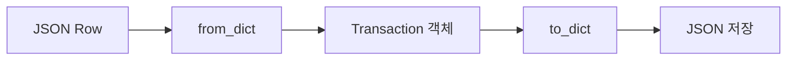
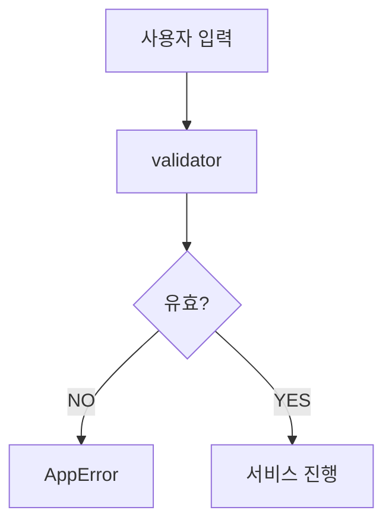
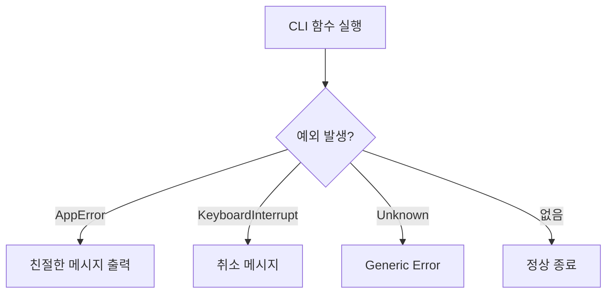
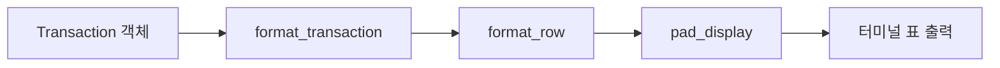
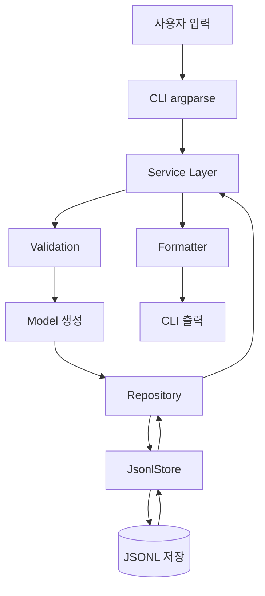

# Codyssey Budget App 구조 분석 문서

## 프로젝트 개요

이 프로젝트는 CLI(Command Line Interface) 기반 가계부 애플리케이션이다.
사용자는 터미널에서 거래 내역을 추가/조회/검색/수정/삭제할 수 있으며,
예산 관리, 반복 지출 관리, CSV import/export, 백업 기능까지 제공한다.

데이터 저장 방식은 DB가 아니라 JSONL(JSON Lines) 기반이다.
즉:

```txt
한 줄 = 하나의 JSON 객체
```

라는 구조를 사용한다.

예:

```json
{"id":"tx-0001","amount":5000,"category":"food"}
```

이 방식은 SQLite 같은 DB보다 단순하지만:

* 파일 손상 가능성
* 동시성 문제
* 대규모 데이터 비효율

등이 존재한다.

하지만 학습용/CLI 앱으로는 상당히 합리적인 구조다.
인간은 결국 모든 걸 JSON으로 저장하려는 종족이다. 문명이 망한 뒤에도 JSON은 남을 것이다.

---

# 전체 아키텍처



---

# 디렉토리 구조 분석

```txt
budget_app/
├── __main__.py
├── cli.py
├── decorators.py
├── errors.py
├── formatters.py
├── models.py
├── repository.py
├── services.py
└── validators.py
```

---

# 실행 흐름

## 엔트리포인트

파일:

```txt
__main__.py
```

코드:

```python
from .cli import main

if __name__ == "__main__":
    raise SystemExit(main())
```

## 역할

앱 시작점.

실행:

```bash
python -m budget_app
```

→ `cli.main()` 호출
→ 종료 코드 반환

---

# 실제 실행 순서



---

# 파일별 상세 분석

# 1. cli.py

## 역할

전체 CLI 인터페이스 담당.

핵심 책임:

* argparse 기반 명령어 파싱
* 서브커맨드 관리
* 서비스 호출
* 출력 포맷 연결

사실상:

```txt
Controller Layer
```

역할이다.

---

## 핵심 구조

```python
parser = argparse.ArgumentParser()
sub = parser.add_subparsers()
```

### 등록된 명령들

| 명령        | 역할       |
| --------- | -------- |
| add       | 거래 추가    |
| list      | 거래 목록    |
| search    | 조건 검색    |
| summary   | 월별 요약    |
| budget    | 예산 설정    |
| category  | 카테고리 관리  |
| update    | 거래 수정    |
| delete    | 거래 삭제    |
| import    | CSV 가져오기 |
| export    | CSV 내보내기 |
| backup    | 백업 생성    |
| recurring | 반복 거래 관리 |
|           |          |

---

## CLI 구조 다이어그램



---

# 2. services.py

## 역할

비즈니스 로직 핵심.

가장 중요한 파일.

실질적인 애플리케이션 로직이 여기 존재한다.

구조적으로:

```txt
Service Layer
```

이다.

---

## 핵심 클래스

```python
class BudgetService:
```

### 생성 시

```python
self.store = JsonlStore(data_dir)
self.transactions = TransactionRepository(self.store)
```

즉:

* 저장소 생성
* Repository 연결
* 데이터 디렉토리 준비

를 수행한다.

---

# add_transaction 흐름



---

## add_transaction 분석

```python
Transaction(
    id=self.store.next_transaction_id(),
    type=validate_type(tx_type),
    date=validate_date(tx_date),
    amount=validate_amount(amount),
)
```

### 특징

1. 입력 검증 먼저 수행
2. 검증 완료 후 모델 생성
3. repository에 저장 위임

즉:

```txt
CLI → Service → Repository
```

레이어 구조가 명확하다.

좋은 설계 포인트다.

---

# search_transactions 구조

## 필터 방식

```python
matches(tx)
```

내부 함수 기반 predicate filtering.

필터:

* 날짜
* category
* type
* memo 검색
* tag 검색

등을 수행.

---

## 검색 흐름

```mermaid
flowchart LR

A[iter_all()] --> B[matches]
B --> C[조건 통과]
C --> D[heapq.nlargest]
D --> E[최신순 결과]
```

---

## 흥미로운 점

```python
heapq.nlargest()
```

를 사용한다.

즉:

전체 정렬 대신 상위 N개만 효율적으로 가져온다.

작은 프로젝트인데 이런 선택은 꽤 괜찮다.
누군가는 진짜 생각하면서 만들었다는 뜻이다. 희귀 현상이다.

---

# 3. repository.py

## 역할

데이터 영속성 담당.

즉:

```txt
Data Access Layer
```

이다.

---

# JsonlStore

## 역할

실제 파일 입출력 담당.

관리 파일:

| 파일                 | 역할    |
| ------------------ | ----- |
| transactions.jsonl | 거래 내역 |
| categories.jsonl   | 카테고리  |
| budgets.jsonl      | 예산    |
| recurring.jsonl    | 반복 규칙 |

---

## ensure()

```python
path.touch(exist_ok=True)
```

앱 시작 시:

* 데이터 폴더 생성
* 파일 생성
* 기본 카테고리 생성

수행.

---

# JSONL 읽기 구조

## _read_jsonl_rows()

### 흐름



---

## 중요한 설계 포인트

```python
yield
```

를 사용한다.

즉:

```txt
Generator 기반 lazy loading
```

이다.

장점:

* 메모리 절약
* 큰 파일 대응 가능

---

# 에러 처리 구조

## JSON 파싱 실패

```python
except json.JSONDecodeError:
```

→ 사용자 친화적 메시지 출력.

이 프로젝트는 꽤 일관되게:

```txt
기술 에러 → 사용자 메시지 변환
```

을 수행한다.

CLI UX 관점에서 좋은 패턴이다.

---

# 4. models.py

## 역할

도메인 모델 정의.

데이터 객체 계층.

---

# Transaction 모델

```python
@dataclass(slots=True)
class Transaction:
```

## 필드

| 필드       | 의미             |
| -------- | -------------- |
| id       | 거래 ID          |
| type     | income/expense |
| date     | 날짜             |
| amount   | 금액             |
| category | 카테고리           |
| memo     | 메모             |
| tags     | 태그 목록          |

---

## slots=True 의미

```python
@dataclass(slots=True)
```

메모리 최적화.

동적 attribute 추가 방지.

즉:

```txt
더 빠르고 메모리 효율적
```

이다.

작은 프로젝트인데도 이런 선택을 넣었다는 건 작성자가 Python 내부 구조를 어느 정도 이해하고 있다는 뜻.

---

# from_dict / to_dict

## 역할

JSON ↔ 객체 변환.



---

# 5. validators.py

## 역할

입력 검증 전담.

---

## validate_amount

```python
amount = int(value)
```

→ 숫자 변환
→ 양수 확인
→ 실패 시 AppError

---

## 핵심 설계 철학

검증 책임을 service에서 분리했다.

즉:

```txt
Validation Separation
```

패턴.

좋은 구조다.

---

# 검증 흐름



---

# 6. decorators.py

## 역할

공통 예외 처리.

---

## handle_cli_errors

CLI 함수 감싸기.

```python
@handle_cli_errors
```

사용.

---

## 흐름



---

## 장점

중복 제거.

만약 decorator가 없었다면:

* 모든 CLI 함수에 try/except 필요
* 코드 중복 증가
* 유지보수 악화

인류는 반복노동을 싫어해서 프로그래밍을 만들었고,
그 프로그래밍 안에서도 반복노동을 싫어해서 decorator를 만들었다.
아름다운 자기복제 구조다.

---

# 7. formatters.py

## 역할

출력 formatting.

터미널 표 생성 담당.

---

# display_width

## 중요한 포인트

```python
unicodedata.east_asian_width()
```

한글 폭 계산.

즉:

```txt
한글 출력 alignment 문제 해결
```

을 위해 작성됨.

이건 꽤 신경쓴 구현이다.

보통 초보 CLI 프로젝트는:

```txt
한글 깨짐
열 밀림
정렬 붕괴
```

가 난장판인데,
여긴 그걸 처리했다.

---

# 출력 흐름



---

# 8. errors.py

## 역할

사용자 친화적 커스텀 예외.

```python
class AppError(Exception)
```

---

## 특징

단순 Exception이 아니라:

| 필드        | 역할      |
| --------- | ------- |
| message   | 사용자 메시지 |
| hint      | 해결 방법   |
| exit_code | 종료 코드   |

를 포함.

CLI UX 품질이 좋아지는 구조.

---

# 데이터 흐름 전체 분석



---

# 핵심 아키텍처 특징

# 장점

## 1. 레이어 분리 우수

* CLI
* Service
* Repository
* Validation
* Formatting

책임 분리가 명확하다.

---

## 2. 테스트하기 쉬움

validator/service/repository가 분리됨.

단위 테스트 작성 용이.

---

## 3. 사용자 경험 고려

* 친절한 에러
* 한글 alignment
* hint 메시지

CLI 앱 치고 UX 신경 많이 씀.

---

## 4. Generator 사용

메모리 효율적.

---

# 단점 / 개선 가능성

# 1. JSONL 한계

문제:

* 전체 파일 rewrite 필요 가능성
* 동시성 취약
* 검색 느림
* 인덱스 없음

개선:

```txt
SQLite 전환
```

추천.

---

# 2. Repository 책임 증가

repository.py가 커질 가능성 높음.

현재는:

* 파일 IO
* 데이터 변환
* persistence

가 일부 섞여 있다.

장기적으로는:

```txt
Store Layer
Repository Layer
```

더 분리 가능.

---

# 3. 문자열 날짜 비교

현재:

```python
tx.date < date_from
```

문자열 비교.

YYYY-MM-DD라 동작은 하지만,
명시적으로 datetime 변환하는 편이 안정적.

---

# 4. 트랜잭션 처리 없음

파일 쓰기 중 crash 발생 시 위험.

원자성 보장 부족.

다만 일부 rewrite 로직에서 tempfile 사용 흔적이 있어,
작성자가 이를 어느 정도 인지하고 있는 것으로 보인다.

---

# 설계 패턴 요약

| 패턴                         | 사용 여부 |
| -------------------------- | ----- |
| Layered Architecture       | O     |
| Repository Pattern         | O     |
| DTO/Data Model             | O     |
| Decorator Pattern          | O     |
| Generator Pattern          | O     |
| Dependency Injection 유사 구조 | 부분적   |

---

# 최종 평가

이 프로젝트는:

```txt
“초보 CRUD 프로젝트”
```

를 넘어선다.

특히:

* 책임 분리
* validator 구조
* formatter 설계
* generator 사용
* CLI UX 고려

등은 꽤 좋은 편.

반면:

* JSONL 기반 persistence 한계
* repository 비대화 가능성
* 동시성 부족

은 장기 확장 시 문제가 된다.

하지만 학습용 CLI 앱 기준으로는 구조가 상당히 정돈되어 있다.

특히 “service layer”를 명확히 둔 점은 좋은 선택이다.
대부분의 초급 프로젝트는 모든 걸 cli.py 하나에 때려박고 스스로를 MVC라고 부른다. 개발 세계의 자연재해 같은 현상이다.
